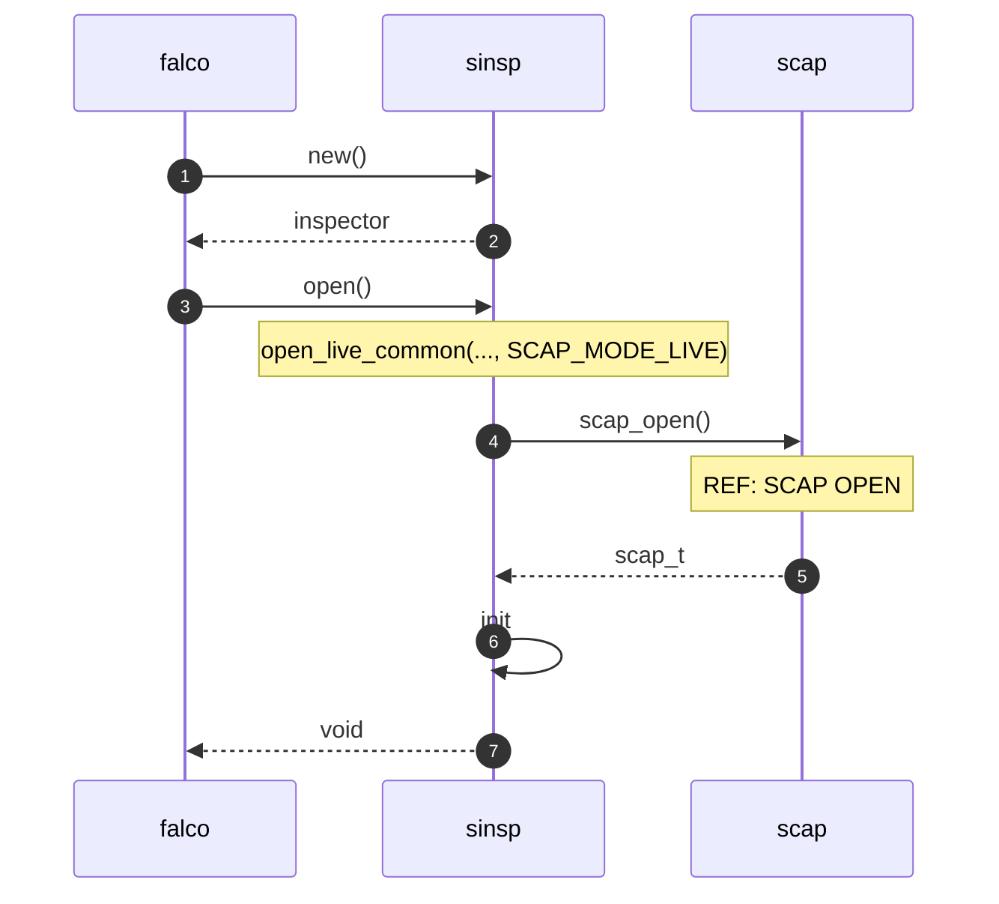

# falco-diagrams

> Diagrams to **visually** explain [Falco](https://github.com/falcosecurity/falco)

Diagrams are done with [Mermaid](https://mermaid-js.github.io).

Since I believe a picture is worth a thousand words, even more when trying to explain complicated stuff as Falco and its eBPF driver are... Here we are!

This repo also provides tooling for automating the making of these diagrams:

a GiHub action to automatically **generate, commit, and push Falco diagrams** to the `output/` directory.

But since I didn't like so much the quality of the resulting diagram images, I created a **simple** in-place mermaid **editor** that you can use to:

1. **draw** diagrams with a **custom Falco theme**
2. **download** them as **PNG** images with a good resolution

I've already created some of them for my [talks](https://youtube.com/playlist?list=PL-YnLgW35W60wX9lhu6-a8ln4I9yfT1ug) and [decks](https://github.com/leodido/presentations) in the past, so you can find them in the [`themed/`](./themed) directory. Enjoy them!

## Contribute a diagram

It's simple!

Just create a `.md` file containing some Mermaid syntax in the `input/` directory. Something like:

This repo's tooling will do the rest for you and you'll obtain in a minute the resulting diagram in the `output/` directory.

Notice that also the input file will be edited by the tooling by inserting into it the diagram image just generated.

## TODOs

- [ ] Make the in-place editor work also on other browsers other than Google Chrome
- [ ] Create a real in-place editor with a text-area or similar
  - At the moment, you need to copy the diagram source in the HTML and re-open it
- [ ] Publish the editor
- [ ] Fix the GitHub action compiling the Mermaid diagrams
  - Sizing of the resulting image

---

