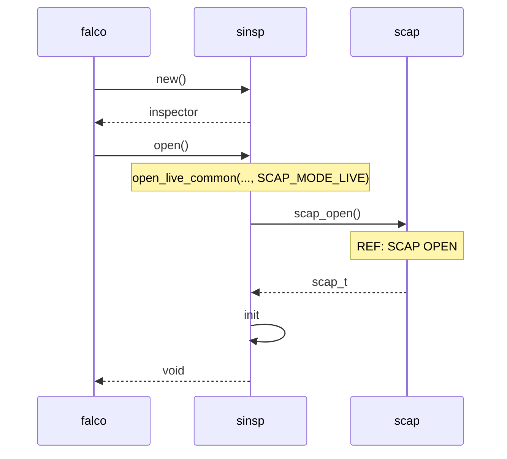

```mermaid
sequenceDiagram
    falco->>sinsp: new()
    sinsp-->>falco: inspector
    falco->>sinsp: open()
    Note over sinsp: open_live_common(..., SCAP_MODE_LIVE)
    sinsp->>scap: scap_open()
    Note over scap: REF: SCAP OPEN
    scap-->>sinsp: scap_t
    sinsp->>sinsp: init
    sinsp-->>falco: void
```