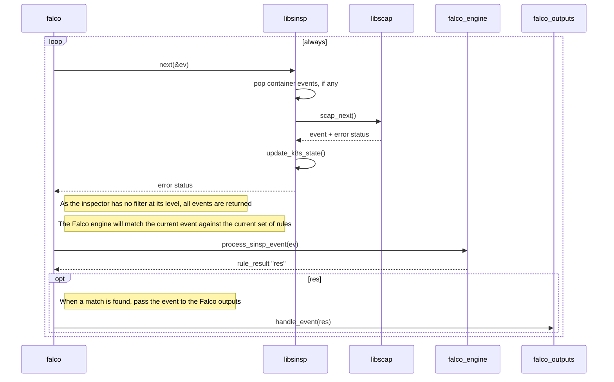

<!-- generated by mermaid compile action - START -->

  
Mermaid markup

```mermaid
sequenceDiagram
loop always
falco->>libsinsp: next(&ev)
libsinsp->>libsinsp: pop container events, if any
libsinsp->>libscap: scap_next()
libscap-->>libsinsp: event + error status
libsinsp->>libsinsp: update_k8s_state()
libsinsp-->>falco: error status

Note right of falco: As the inspector has no filter at its level, all events are returned
Note right of falco: The Falco engine will match the current event against the current set of rules
falco->>falco_engine: process_sinsp_event(ev)
falco_engine-->>falco: rule_result "res"

opt res
Note right of falco: When a match is found, pass the event to the Falco outputs
falco->>falco_outputs: handle_event(res)
end
end
```

<!-- generated by mermaid compile action - END -->
