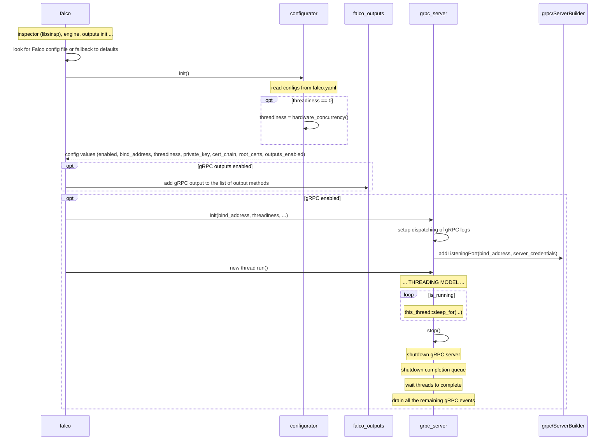

<!-- generated by mermaid compile action - START -->

  
Mermaid markup

```mermaid
sequenceDiagram
    Note over falco: inspector (libsinsp), engine, outputs init ...
    falco->>falco: look for Falco config file or fallback to defaults
    falco->>configurator: init()
    Note over configurator: read configs from falco.yaml
    opt threadiness == 0
    configurator->>configurator: threadiness = hardware_concurrency()
    end
    configurator-->>falco: config values (enabled, bind_address, threadiness, private_key, cert_chain, root_certs, outputs_enabled)
    opt gRPC outputs enabled
    falco->>falco_outputs:  add gRPC output to the list of output methods
    end
    opt gRPC enabled
    falco->>grpc_server: init(bind_address, threadiness, ...)
    grpc_server->>grpc_server: setup dispatching of gRPC logs
    grpc_server->>grpc/ServerBuilder: addListeningPort(bind_address, server_credentials)
    falco->>grpc_server: new thread run()
    Note over grpc_server: ... THREADING MODEL ...
    loop is_running
    Note over grpc_server: this_thread::sleep_for(...)
    end
    grpc_server->>grpc_server: stop()
    Note over grpc_server: shutdown gRPC server
    Note over grpc_server: shutdown completion queue
    Note over grpc_server: wait threads to complete
    Note over grpc_server: drain all the remaining gRPC events
    end
```

<!-- generated by mermaid compile action - END -->
