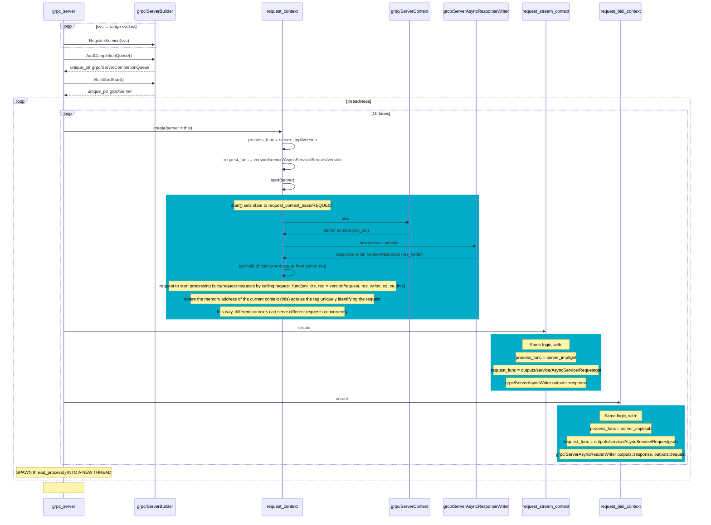

```mermaid
sequenceDiagram
    loop svc := range svcList
    grpc_server->>grpc/ServerBuilder: RegisterService(svc)
    end
    grpc_server->>grpc/ServerBuilder: AddCompletionQueue()
    grpc/ServerBuilder-->>grpc_server: unique_ptr grpc/ServerCompletionQueue
    grpc_server->>grpc/ServerBuilder: BuildAndStart()
    grpc/ServerBuilder-->>grpc_server: unique_ptr grpc/Server
    loop threadiness
    loop 10 times
    grpc_server->>request_context: create(server = this)
    request_context->>request_context: process_func = server_impl/version
    request_context->>request_context: request_func = version/service/AsyncService/Requestversion
    request_context->>request_context: start(server)
    rect rgb(0, 172, 199)
    Note over request_context: start() sets state to request_context_base/REQUEST
    request_context->>grpc/ServerContext: new
    grpc/ServerContext-->>request_context: server context (srv_ctx)
    request_context->>grcp/ServerAsyncResponseWriter: new(server context)
    grcp/ServerAsyncResponseWriter-->>request_context: response writer version/response (res_writer)
    request_context->>request_context: get hold of concurrent queue from server (cq)
    Note over request_context: request to start processing falco/request requests by calling request_func(srv_ctx, req = version/request, res_writer, cq, cq, this)
    Note over request_context:  where the memory address of the current context (this) acts as the tag uniquely identifying the request
    Note over request_context: this way, different contexts can serve different requests concurrently
    end
    grpc_server->>request_stream_context: create
    rect rgb(0, 172, 199)
    Note over request_stream_context: Same logic, with:
    Note over request_stream_context: process_func = server_impl/get
    Note over request_stream_context: request_func = outputs/service/AsyncService/Requestget
    Note over request_stream_context: grpc/ServerAsyncWriter outputs::response
    end
    grpc_server->>request_bidi_context: create
    rect rgb(0, 172, 199)
    Note over request_bidi_context: Same logic, with:
    Note over request_bidi_context: process_func = server_impl/sub
    Note over request_bidi_context: request_func = outputs/service/AsyncService/Requestgsub
    Note over request_bidi_context: grpc/ServerAsyncReaderWriter outputs::response, outputs::request
    end
    end
    Note over grpc_server: SPAWN thread_process() INTO A NEW THREAD
    end
    Note over grpc_server: ...
```
