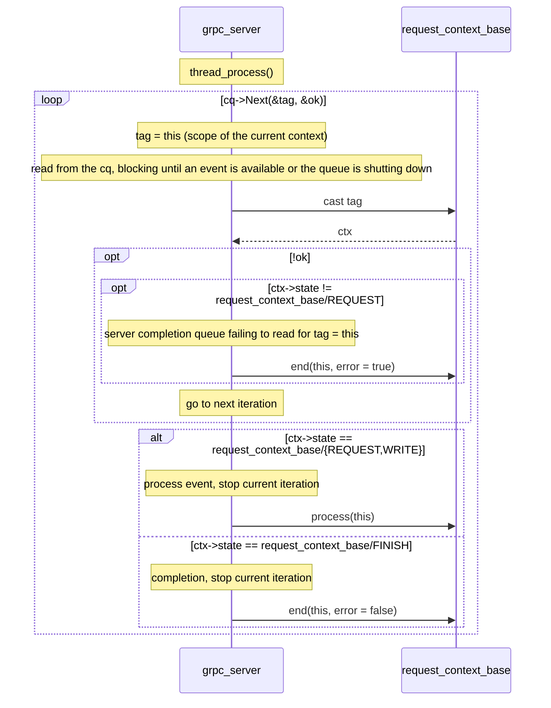

```mermaid
sequenceDiagram
Note over grpc_server: thread_process()
loop cq->Next(&tag, &ok)
    Note over grpc_server: tag = this (scope of the current context)
    Note over grpc_server: read from the cq, blocking until an event is available or the queue is shutting down
    grpc_server->>request_context_base: cast tag
    request_context_base-->>grpc_server: ctx
    opt !ok
    opt ctx->state != request_context_base/REQUEST
    Note over grpc_server: server completion queue failing to read for tag = this
    grpc_server->>request_context_base: end(this, error = true)
    end
    Note over grpc_server: go to next iteration
    end
    alt ctx->state == request_context_base/{REQUEST,WRITE}
    Note over grpc_server: process event, stop current iteration
    grpc_server->>request_context_base: process(this)
    else ctx->state == request_context_base/FINISH
    Note over grpc_server: completion, stop current iteration
    grpc_server->>request_context_base: end(this, error = false)
    end
end
```