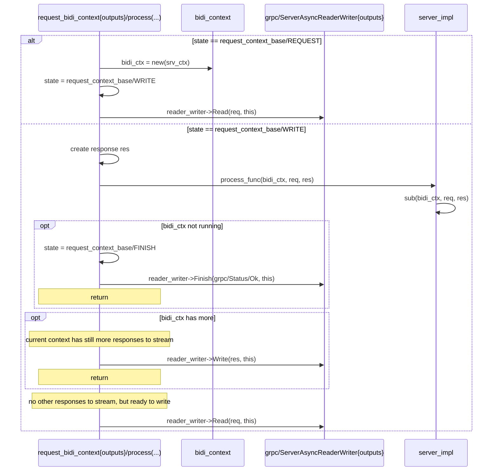

```mermaid
sequenceDiagram
    alt state == request_context_base/REQUEST
    request_bidi_context{outputs}/process(...)->>bidi_context: bidi_ctx = new(srv_ctx)
    request_bidi_context{outputs}/process(...)->>request_bidi_context{outputs}/process(...): state = request_context_base/WRITE
    request_bidi_context{outputs}/process(...)->>grpc/ServerAsyncReaderWriter{outputs}: reader_writer->Read(req, this)
    else state == request_context_base/WRITE
    request_bidi_context{outputs}/process(...)->>request_bidi_context{outputs}/process(...): create response res
    request_bidi_context{outputs}/process(...)->>server_impl: process_func(bidi_ctx, req, res)
    server_impl->>server_impl: sub(bidi_ctx, req, res)
    opt bidi_ctx not running
    request_bidi_context{outputs}/process(...)->>request_bidi_context{outputs}/process(...): state = request_context_base/FINISH
    request_bidi_context{outputs}/process(...)->>grpc/ServerAsyncReaderWriter{outputs}: reader_writer->Finish(grpc/Status/Ok, this)
    Note over request_bidi_context{outputs}/process(...): return
    end
    opt bidi_ctx has more
    Note over request_bidi_context{outputs}/process(...): current context has still more responses to stream
    request_bidi_context{outputs}/process(...)->>grpc/ServerAsyncReaderWriter{outputs}: reader_writer->Write(res, this)
    Note over request_bidi_context{outputs}/process(...): return
    end
    Note over request_bidi_context{outputs}/process(...): no other responses to stream, but ready to write
    request_bidi_context{outputs}/process(...)->>grpc/ServerAsyncReaderWriter{outputs}: reader_writer->Read(req, this)
    end
```