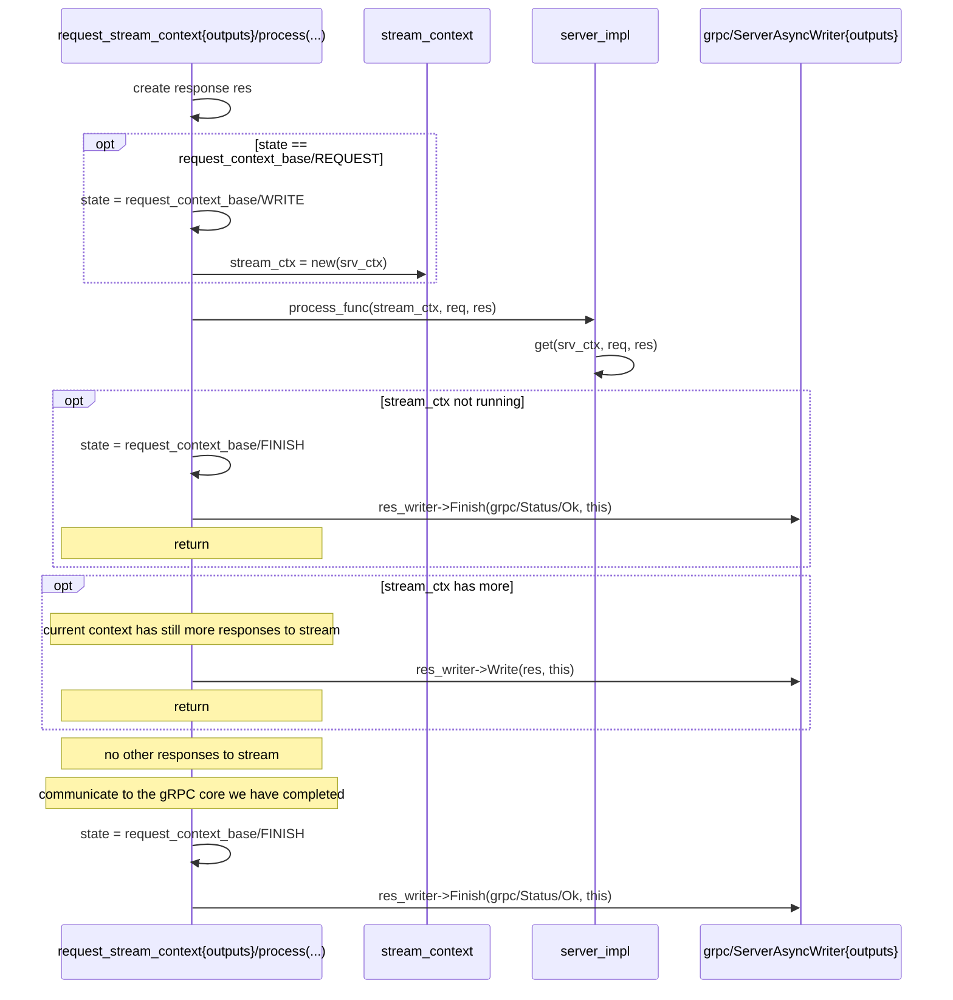

<!-- generated by mermaid compile action - START -->

  
Mermaid markup

```mermaid
sequenceDiagram
    request_stream_context{outputs}/process(...)->>request_stream_context{outputs}/process(...): create response res
    opt state == request_context_base/REQUEST
    request_stream_context{outputs}/process(...)->>request_stream_context{outputs}/process(...): state = request_context_base/WRITE
    request_stream_context{outputs}/process(...)->>stream_context: stream_ctx = new(srv_ctx)
    end
    request_stream_context{outputs}/process(...)->>server_impl: process_func(stream_ctx, req, res)
    server_impl->>server_impl: get(srv_ctx, req, res)
    opt stream_ctx not running
    request_stream_context{outputs}/process(...)->>request_stream_context{outputs}/process(...): state = request_context_base/FINISH
    request_stream_context{outputs}/process(...)->>grpc/ServerAsyncWriter{outputs}: res_writer->Finish(grpc/Status/Ok, this)
    Note over request_stream_context{outputs}/process(...): return
    end
    opt stream_ctx has more
    Note over request_stream_context{outputs}/process(...): current context has still more responses to stream
    request_stream_context{outputs}/process(...)->>grpc/ServerAsyncWriter{outputs}: res_writer->Write(res, this)
    Note over request_stream_context{outputs}/process(...): return
    end
    Note over request_stream_context{outputs}/process(...): no other responses to stream
    Note over request_stream_context{outputs}/process(...): communicate to the gRPC core we have completed
    request_stream_context{outputs}/process(...)->>request_stream_context{outputs}/process(...): state = request_context_base/FINISH
    request_stream_context{outputs}/process(...)->>grpc/ServerAsyncWriter{outputs}: res_writer->Finish(grpc/Status/Ok, this)
```

<!-- generated by mermaid compile action - END -->
